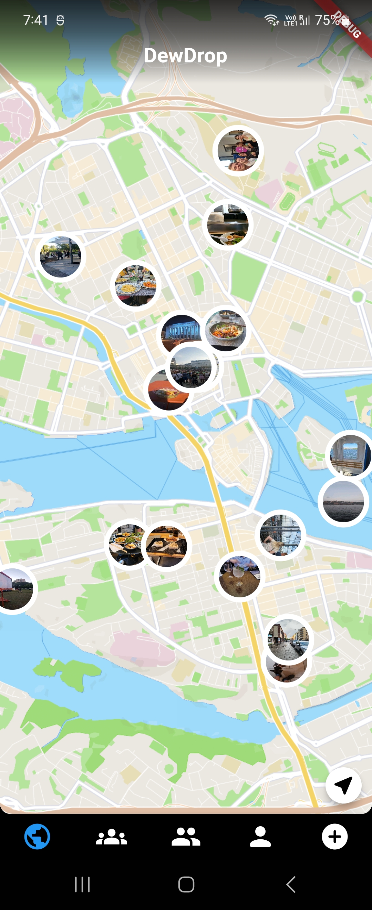
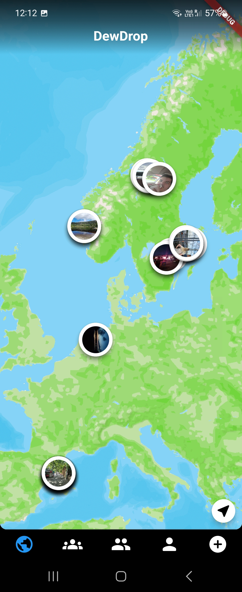
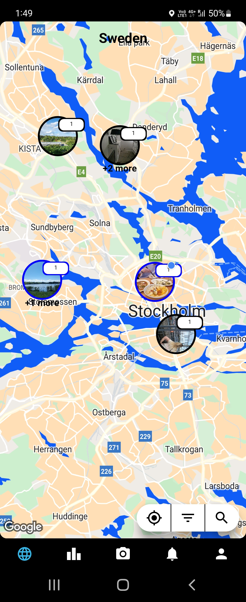
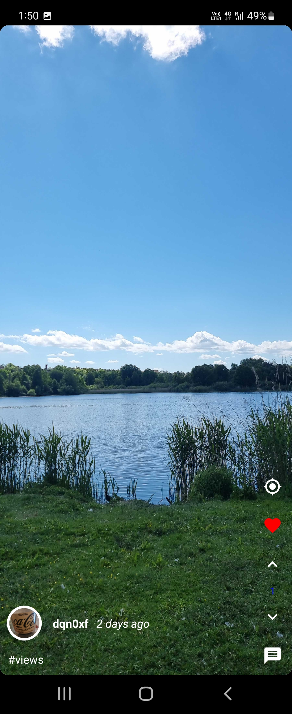

 

###  Hello! My name is James Tammila, and I enjoy making apps.</h1>  

**Languages:** &nbsp;&nbsp; 

**Frameworks:** &nbsp;&nbsp; 

**Database & Services:** &nbsp;&nbsp; 

**Design:** &nbsp;&nbsp; 

**Tools:** &nbsp;&nbsp; 

**Currently Learning:** &nbsp;&nbsp; 

&nbsp;

### 📱 Apps

 

 

### Jumbl
> 🟢 **Active**

 

**Description:** &nbsp; A fun new social media app where you share themed photos with friends! Think BeReal but on creative steroids! Released early February 2026!

 

**Architecture:** &nbsp; Clean Architecture · BLoC · Repository Pattern · Offline Support · Reactive Streams · Dependency Injection

 

**Features:** &nbsp; OAuth (Apple & Google) · Firebase AppCheck · REST API · Streaming Responses · Cursor Based Pagination · Image Processing · Image Caching · FCM Push Notifications · In-App Notifications · Local Push Notifications · WorkManager · User Profiles · User Search · Bidirectional Friendship System · Comment System · Custom Reaction System · Blocking & Reporting · Firebase Crashlytics

 

**Built With:** &nbsp;&nbsp; 

 

**Download & Links:** &nbsp;&nbsp;  &nbsp;  &nbsp;  &nbsp; 

 

 

### DewDrop (Pinnit v2)
> 🔴 **Inactive**

 

**Description:** &nbsp; The second version of Pinnit, rebranded to DewDrop and rewritten in Flutter.

 

**Built With:** &nbsp;&nbsp; 

 

**Download & Links:** &nbsp;&nbsp; 

 

**Preview:** 

 

  
  
  

 

 

### Pinnit
> 🔴 **Inactive**

 

**Description:** &nbsp; Where geo-tagging meets social media! An app where users can share images and short videos on a global interactive map, allowing you to travel the world from your home!

 

**Built With:** &nbsp;&nbsp; 

 

**Download & Links:** &nbsp;&nbsp; 

 

**Preview:** 

 

  
  
  

 

 

<picture>
  <source media="(prefers-color-scheme: dark)" srcset="https://github.com/JamesTammila/JamesTammila/blob/output/github-contribution-grid-snake-dark.svg"/>
  <source media="(prefers-color-scheme: light)" srcset="https://github.com/JamesTammila/JamesTammila/blob/output/github-contribution-grid-snake.svg"/>
  
</picture>

 
