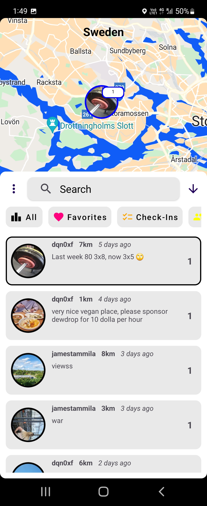

###  Hello! My name is James Tammila, and I enjoy making apps.</h1>

### 📱 Apps

### Jumbl
> 🟢 **Active**

Description: A fun new social media app where you share themed photos with friends! Released at the beginning of this year. 

iOS Download Link: https://apps.apple.com/us/app/jumbl-post-together/id6448725808

Android Download Link: https://play.google.com/store/apps/details?id=social.jumbl.jumbl

Website Link: https://jumbl.social/

Repository Link: Repository is private since app is active.

### DewDrop (Pinnit v2)
> 🔴 **Inactive**

Description: A social media app where people post on an interactive global map!

Preview Demo:

Preview Images:

  
  
  

Repository Link: https://github.com/JamesTammila/dewdrop

### Pinnit
> 🔴 **Inactive**

Description: A social media app where people post on an interactive global map!

Preview Images:

  
  
  
  
  
  

Repository Link: https://github.com/JamesTammila/Pinnit
